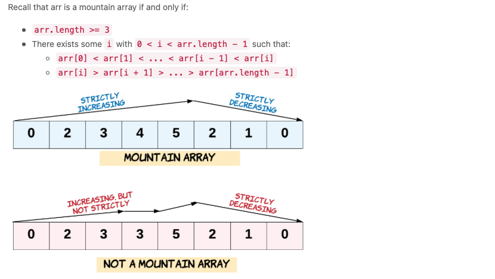

[TOC]


# Array Problems 

### Question 1:  Find consecutive 1s in an array. 

Given an array, find the maximum of consecutive 1s in an array.

Here's an example:

```python
Input: [1,1,0,1,1,1]
Output: 3
Explanation: The first two digits or the last three digits are consecutive 1s.
    The maximum number of consecutive 1s is 3.
```

The solution to the problem consists of counting the numbers and resetting them when we come across a different number. Here is the solution.

```python
def findMaxConsecutiveOnes(arr):
    n = len(arr)
    max_length = 0
    count = 0
    for n in arr:
        if n == 1:
            count += 1
        else:
            max_length = max(max_length, count)
            count = 0
    max_length = max(max_length, count)
    return max_length
```

### Question 2: Find Numbers with Even Number of Digits

Given an array `nums` of i integers, return how many of them contain an even number of digits. Here is an example:

```python
Input: nums = [12,345,2,6,7896]
Output: 2
Explanation: 
12 contains 2 digits (even number of digits). 
345 contains 3 digits (odd number of digits). 
2 contains 1 digit (odd number of digits). 
6 contains 1 digit (odd number of digits). 
7896 contains 4 digits (even number of digits). 
Therefore only 12 and 7896 contain an even number of digits.
```

This is a fairly simple problem. You can solve it in the following way:

```python
def find_numbers(nums):
    count = 0
    for num in nums:
        this_num = str(num)
        length = len(this_num)
        if length % 2 == 0:
            count += 1
    return count
```

### Question 3: Squares of a Sorted Array

Given an integer array `nums` sorted in non-decreasing order, return an array of the squares of each number sorted in non-decreasing order. 

Here is an example, 

```python
Input: nums = [-4,-1,0,3,10]
Output: [0,1,9,16,100]
Explanation: After squaring, the array becomes [16,1,0,9,100].
After sorting, it becomes [0,1,9,16,100].
```

The idea here is that the array is sorted in the decreasing order. So, the square of the values would be higher either on the left-hand side and/or the right and side. We would expect the middle to have lower values. 

The best way to tackle this problem is to create an empty list of the same size as the original list. Then use two pointers, one on the left and the other on the right. Depending on which absolute value is higher, the square of that number will be larger. So, add that number in the new array from right to left. 

```python
def sortedSquares(nums):
    n = len(nums)
    result = [0] * n
    left = 0
    right = n - 1
    index = right
    while left <= right:
        if abs(nums[left]) < abs(nums[right]):
            square = nums[right]
            result[index] = square ** 2
            right -= 1
            index -= 1
        else:
            square = nums[left]
            result[index] = square ** 2
            left += 1
            index -= 1
    return result
```

### Question 4: Duplicate Zeros

Given a fixed length array of integers, duplicate each occurrences of zero, shifting the remaining elements in the right. Note that the elements beyond the length of the original array are not written. Do the above modification in place. 

```python
Input: [1,0,2,3,0,4,5,0]
Output: null
Explanation: After calling your function, the input array is modified to: [1,0,0,2,3,0,0,4]
```

The trick here is to record the positions where zeros need to be inserted in a new list. The first loop removes elements from the end of the list while the second one inserts zeros at the positions. 

```python
def duplicateZeros(arr):
    insert_list = []
    for index, i in enumerate(arr):
        if i == 0:
            insert_list.append(index)
            arr.pop()
    count = 1
    for i in insert_list:
        insert_val = i + count
        arr.insert(insert_val, 0)
        count += 1
    return arr
```

### Question 5: Merge Sorted Array

Given two sorted integer arrays `num1` and `num2`, merge `num2` into `num1` as one sorted array. The number of elements initialized in `nums1` and `nums2` are `m` and `n` respectively. You may assume that `nums1` has a size equal to `m + n` such that it has enough space to hold additional elements from `nums2`.

Here is an example:

```python
Input: nums1 = [1,2,3,0,0,0], m = 3, nums2 = [2,5,6], n = 3
Output: [1,2,2,3,5,6]
```


### Question 6: Remove Element

Given an array `nums` and a value `val`, remove all instances of that value in-place and return the new length. 

```python
Input: nums = [3,2,2,3], val = 3
Output: 2, nums = [2,2]
Explanation: Your function should return length = 2, with the first two elements of nums being 2.
It doesn't matter what you leave beyond the returned length. For example if you return 2 with nums = [2,2,3,3] or nums = [2,2,0,0], your answer will be accepted.
```

And here is the second example: 

```python
Input: nums = [0,1,2,2,3,0,4,2], val = 2
Output: 5, nums = [0,1,4,0,3]
Explanation: Your function should return length = 5, with the first five elements of nums containing 0, 1, 3, 0, and 4. Note that the order of those five elements can be arbitrary. It doesn't matter what values are set beyond the returned length.
```

The idea is fairly simple. When the current value is equal to the value, we swap that with the end value and shrink the length of the array by 1 from the end. 

```python
def remove_element(arr, value):
    n = len(arr)
    start = 0
    while start < n:
        if arr[start] == value:
            arr[start], arr[n-1] = arr[n-1], arr[start]
            n -= 1
        else:
            start += 1
    return n
```

### Question 7. Remove Duplicates from Sorted Array

Given a sorted array, remove the duplicates in-place such that each element appears only once and returns the new length. 

```python
Input: nums = [0,0,1,1,1,2,2,3,3,4]
Output: 5, nums = [0,1,2,3,4]
Explanation: Your function should return length = 5, with the first five elements of nums being modified to 0, 1, 2, 3, and 4 respectively. It doesn't matter what values are set beyond the returned length.
```

The key idea here is that you copy the value associated with `arr[end]` when it is not equal to `arr[start]`. Of course, you make use of two pointers trick here. 

```python
def remove_duplicates(arr):
    n = len(arr)
    start = 0
    for end in range(1, n):
        if arr[start] != arr[end]:
            start += 1
            arr[start] = arr[end]
    return arr
```

### Question 8. Check if N and its Double Exists

Given an array of integers, check if there exists two integers `N` and `M` such that `N` is the double of `M`. (i.e. `N = 2 * M`). 

```python
Input: arr = [7,1,14,11]
Output: true
Explanation: N = 14 is the double of M = 7,that is, 14 = 2 * 7.
```

Another example: 

```python
Input: arr = [3,1,7,11]
Output: false
Explanation: In this case does not exist N and M, such that N = 2 * M.
```

The key idea is to create a set and store the double of the current value in the set. Check in each iteration whether the double or 1/2 of the current value is present. If so, return true else return false. 

```python
def find_double(arr):
    seen = set()
    for val in arr:
        if 2*val in seen or 0.5*val in seen:
            return True
        seen.add(val)
    return False
```

### Question 9. Valid Mountain Array

Given an array of integers, `arr`, return `True` if and only if it is a valid mountain. 



```python
Input: arr = [3,5,5]
Output: false
```

```python
Input: arr = [0,3,2,1]
Output: true
```

