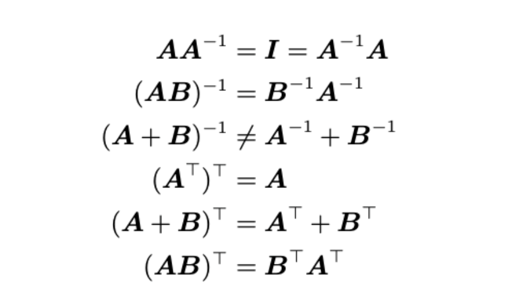
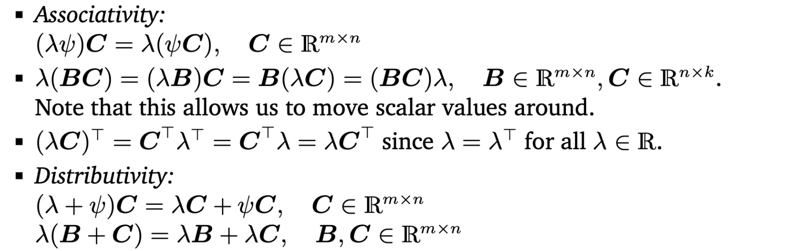
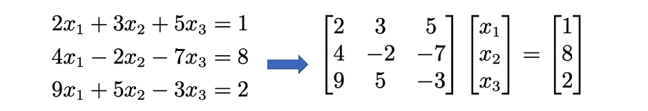

[TOC]

# Mathematics of Deep Learning Chapter Summaries

These are the summaries of each of the book chapters. 

## Chapter 1: Introduction

There are three core topics in machine learning: 

*   **Data** - are used to extract valuable information and patterns that help a ML system make predictions. Data is often represented by vectors and/or matrices
*   **Models** - are used to learn from the data and generalize the patterns to unseen data. 
*   **Learning** - happens when the model learns from the data through optimization of model's hyperparameters such that the cost function, a user-defined metric to measure performance, is reduced. 

ML is can thought of as a construction of a foundation and four pillars:

*   ML Foundation:
    *   **Linaer Algebra** - a study of vectors and matrices. 
    *   **Analytic Geometry** - a study of geometry using coordinate systems. Distance measurements, angles, similarity between vectors and matrices come from this domain.
    *   **Matrix Decomposition** - part of linear algebra which includes various methods and techniques to solve systems of linear equations.
    *   **Vector Calculus** - concerns the use of differentiation and integration of vectors. In the ML context, it is often used for optimization. 
    *   **Probability & Distributions** - measures the uncertainty in data and predictions.
    *   **Optimization** - methods and techniques used to find the best available values of some objective function given a defined domain. The objective function indicates how much each variable contributes to the value to be optimized in the problem. 
*   Pillars that rest on the foundation:
    *   **Regression** - Linear regression allows us to map $\bold{x}\in \R^D$ to corresponding observed function values in $y \in \R$. 
    *   **Dimensionality Reduction** - techniques used to reduce the dimensions of a dataset by finding a lower-dimension representation. Such representation allows us to solve the problem more easily. 
    *   **Density Estimation** - The objective is to find a probability distribution that describes a given dataset, which is often approximated by the use of Gaussians.
    *   **Classification** - Here we seek to map $\bold{x} \in \R^D$ to multiple categories.

## Chapter 2: Linear Algebra

 Algebra associates symbols with objects and manipulates these symbols by constructing a set of rules. This is known as Algebra. 

A function is said to be linear if it has the following properties: 
$$
f(x + y) = f(x) + f(y) \\[15pt]
f(\lambda x) = \lambda f(x)
$$
where $x, y$ are vectors and $\lambda$ is a scalar. A discipline of algebra that studies these linear functions is known as **Linear Algebra**.

### Vectors

>   An object is said to be a **vector** if it can be added or be multiplied by a scalar to produce the same kind of object.

### Matrices

A **matrix** is a collection of vectors. Vectors in matrices are often represented by columns. Matrices are often represented by upper case alphabets.

Here are some properties of matrices:

*   Matrix addition is element-wise

*    Matrix product of two matrices is defined as:

    

*   An **identity matrix** is a square matrix whose diagonals are all 1 while the off-diagonal terms are all 0. Identity matrix is represented by $\bold{I_n}$, where $n$ is the dimension of that matrix.  

*   Matrix multiplication is **associative**: $(AB)C = A(BC)$

*   Matrix addition is distributive: $(A+B)C = AC + BC$ and $A(B+C) = (AB + AC)$

*   Matrix multiplication with an identify matrix gives back the original matrix: $\bold{AI_n} = \bold{I_nA} = \bold{A}$.

*   Given a matrix, $\bold{A}$, matrix $\bold{B}$ is said to be an inverse of $\bold{A}$ if $\bold{AB} = \bold{I_n} = \bold{BA}$. Only square matrices can have inverses. 

*   Given a matrix, $\bold{A}$, the matrix $\bold{B}$ is said to be a transpose of $\bold{A}$ if $b_{ji} = a_{ij}$. Here are some more properties of inverse and transpose:

    

*   If $\bold{A}$ = $\bold{A^T}$, then the matrix is said to be symmetric. 

*   Here are some properties of matrices multiplied by scalars:

    

### Systems of Linear Equations

**Systems of linear equations** play a central part in linear algebra. Many problems can be forumulated as or boiled down to systems and linear algebra gives us the tools to solve them. Such a system of linear equations can be written compactly as, 
$$
\bold{Ax} = {\bold{y}}
$$
where $\bold{A}$ is a matrix while $\bold{x, y}$ are vectors. For example, a system of linear equation can often be represented more compactly by a matrix and a vector:

There are many techniques to solve a system of linear equations. Here's one that is often followed: 

1.  Subtract the rows of a matrix is in a way that we left off-diagonal values are all zero. This is known as **row-echelon** form. 
2.  Once you have this form, the solution is trivial.
3.  If there are more unknowns than knowns, then to find all possible solutions:
    1.  Find a particular solution to $\bold{Ax} = \bold{b}$. 
    2.  Find all solutions to $\bold{Ax} = \bold{0}$.
    3.  Combine the solutions from steps 1 and 2 to the general solution.

When in a row-echelon form, the first non-zero value in a given row at the right position is known as a **pivot**. 

Calculating an **inverse of a matrix** is done through Gaussian Elimination. Inverse of a matrix is often computational intensive so inverse of matrices are often done for smaller matrices. 

### Vector Spaces

A major idea in mathematics is the idea of **closure**. This is the question: "What is the **set** of **all things** that can result from a **proposed operations**?" In the case of vectors, this question will be "What is the **set** of **vectors** that can result by starting with **a small set of vectors, and adding them to each other and scaling them**?" This results in a **vector space**. 

